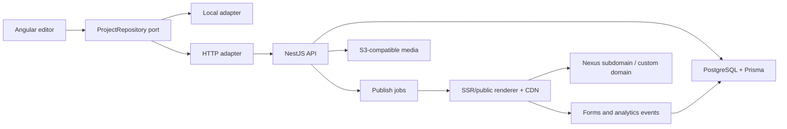
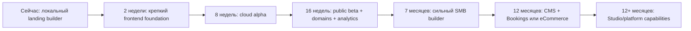

# Nexus: дорожная карта до production-конструктора уровня Wix

Актуально на 26 июля 2026 года.

## Короткий вывод

Nexus уже является качественным frontend-прототипом конструктора лендингов, а не пустым
макетом. В проекте есть мастер создания, редактор секций, 11 типов блоков, темы,
адаптивный preview, история изменений, локальные проекты, локальные релизы и формы
заявок.

Следующая цель не должна звучать как «скопировать весь Wix». Wix одновременно
является редактором, CMS, хостингом, CRM, eCommerce-платформой, системой бронирований,
маркетинговым набором, средой совместной работы и экосистемой приложений. Попытка
развивать все эти направления параллельно оставит Nexus демонстрацией надолго.

Рекомендуемая цель Nexus 1.0:

> Пользователь без разработчика создает многостраничный сайт услуг, редактирует его,
> загружает медиа, подключает домен, публикует SEO-доступную версию, принимает заявки
> или запросы на запись и видит реальную конверсию.

Это достижимо за 4–5 месяцев командой из 3–4 инженеров при наличии продуктового
дизайна. Для одного разработчика реалистичный срок следует умножить примерно в
3 раза. Полный набор возможностей, сравнимый с Wix Studio, — многолетняя программа,
а не один релиз.

Рабочая декомпозиция находится в трёх документах:

- [программа выполнения](docs/superpowers/plans/2026-07-25-nexus-roadmap-execution-program.md)
  связывает этапы, зависимости и контрольные точки;
- [детальный план этапа 0](docs/superpowers/plans/2026-07-25-nexus-foundation-phase-0.md)
  содержит последовательные задачи, файлы, тесты, команды и коммиты;
- [детальный план Cloud Alpha P1](docs/superpowers/plans/2026-07-26-nexus-cloud-alpha-phase-1.md)
  фиксирует архитектуру отдельного backend-проекта, контракты модулей и порядок
  подключения Angular к облаку.

## Что есть сейчас

### Сильные стороны

- Angular 20, standalone-компоненты, Signals, strict TypeScript, OnPush, Material и CDK.
- Конфигурация сайта отделена от UI редактора; публичные блоки не зависят от Material.
- `SiteConfig` уже содержит массив страниц, глобальную тему, данные бизнеса и SEO.
- Реестр блоков централизует метаданные, варианты, создание и клонирование секций.
- 11 типов секций: header, hero, content + media, features, offers, gallery,
  testimonials, FAQ, CTA, lead form и footer.
- Контент, дизайн и поведение секции редактируются раздельно.
- Есть desktop/mobile preview, container queries, скрытие, дублирование,
  переупорядочивание и удаление секций.
- Есть undo/redo на 50 состояний.
- Локальные проекты имеют версии черновика, ревизии и неизменяемые опубликованные
  релизы — это хорошая основа будущей серверной модели.
- Редактор, workspace и public preview работают через асинхронный
  `ProjectRepository`; локальный adapter изолирован от UI и store документа.
- Поддерживаются многостраничность, уникальные slug, SEO отдельной страницы,
  локальные public URL и page-level not found.
- Проекты экспортируются и импортируются через версионируемый `.nexus.json`.
- Autosave сериализует записи, восстанавливает активный проект после reload и
  показывает конфликт `draftVersion` без перезаписи данных.
- Локальные данные нормализуются, версия схемы контролируется, небезопасные ссылки
  отбрасываются.
- Основные публичные интеракции учитывают accessibility: доступное меню, FAQ,
  lightbox с управлением фокусом, валидация форм.
- На Gate P0 проходят lint, 20 source-contract тестов, 83 TestBed/Vitest теста,
  source-contract smoke, 3 Playwright-сценария и production build. Initial
  production bundle — около 399 KB raw при бюджете 500 KB warning / 1 MB error.

### Ограничения, которые блокируют production

1. **Нет backend и аккаунтов.** Проекты, релизы и заявки существуют только в
   `localStorage` одного браузера.
2. **Публикация не публичная.** Route `/p/:projectId` читает локальное хранилище.
   Ссылку нельзя отправить клиенту.
3. **Нет настоящего медиа-хранилища.** Поддерживаются URL и локальные data URL, а
   все состояние ограничено примерно 4,5 млн символов.
4. **SEO остается клиентским.** Page-level title, description, social image и
   `noIndex` уже есть, но нет SSR/SSG, sitemap, robots.txt, canonical URL,
   redirects и structured data.
5. **Статистика не является веб-аналитикой.** Dashboard считает локальные проекты,
   блоки, релизы и заявки, но не визиты, источники, события и конверсию.
6. **Workspace пока демонстрационный.** Профиль и контакты статичны, нет команд,
   ролей, приглашений, тарифов и управления доменами.
7. **Редактор секционный, а не свободный.** Нет element-level canvas, сетки,
   пользовательских breakpoints, анимаций и reusable components. Для первого
   production-релиза это допустимое и даже полезное ограничение.
8. **Документный store остается крупным.** `BuilderStore` содержит около 2000
   строк, хотя project/session и history уже вынесены. Новые CMS и collaboration
   обязанности нельзя возвращать в него.
9. **P0 покрывает критический happy path, но не production-нагрузку.** Есть реальные
   browser E2E для autosave, transfer, multipage publish и формы, однако cloud
   concurrency, сетевые ошибки, SSR и внешняя доставка заявок появятся только после
   backend.
10. **После P0-review остались локальные edge case’ы сохранения.** Перед подключением
    HTTP adapter нужно разрешить повтор той же revision после ошибки записи, сохранять
    ожидающий debounce перед выходом из builder, показывать ошибку создания проекта и
    очищать документ при неуспешной инициализации другого project route.

## С чем сравниваем

По актуальным официальным материалам Wix платформа включает:

- AI-создание, шаблоны, свободный drag-and-drop, мобильный редактор, глобальные
  стили, анимации и большую библиотеку компонентов;
- CMS-коллекции, динамические страницы, историю и восстановление сайта;
- домены, хостинг, CDN, SSL, масштабирование и recovery;
- CRM, аналитику, email-маркетинг, SEO, eCommerce, бронирования, блог, события и
  другие отраслевые решения;
- роли, разрешения, concurrent editing, комментарии на canvas и общие библиотеки;
- API, custom code и рынок приложений.

Источники:

- [Wix Features](https://www.wix.com/features/main)
- [Wix Studio Features](https://www.wix.com/studio/features)
- [Wix Studio collaboration](https://support.wix.com/en/article/studio-editor-collaborating-on-a-site)

Для Nexus это benchmark пользовательских результатов, а не обязательный backlog
для буквального копирования каждой функции.

## Матрица зрелости

Шкала: `0` — отсутствует, `1` — UI/демо, `2` — работает локально, `3` — production
MVP, `4` — зрелая платформа.

| Направление                    | Сейчас | Nexus 1.0 | Позже |
| ------------------------------ | -----: | --------: | ----: |
| Мастер и шаблоны               |      2 |         3 |     4 |
| Редактор секций                |      2 |         3 |     4 |
| Свободный element-level canvas |      0 |         0 |     3 |
| Многостраничность              |      2 |         3 |     4 |
| Responsive design              |      2 |         3 |     4 |
| Версии и восстановление        |      2 |         3 |     4 |
| Cloud persistence              |      0 |         3 |     4 |
| Медиа-библиотека               |      1 |         3 |     4 |
| Публикация и хостинг           |      1 |         3 |     4 |
| Домены и SSL                   |      0 |         3 |     4 |
| SEO                            |      2 |         3 |     4 |
| Формы и CRM                    |      2 |         3 |     4 |
| Аналитика посетителей          |      0 |         3 |     4 |
| Аккаунты и workspace           |      1 |         3 |     4 |
| Роли и комментарии             |      0 |         1 |     4 |
| CMS и динамические страницы    |      0 |         1 |     4 |
| Бронирования                   |      1 |         2 |     4 |
| eCommerce                      |      0 |         0 |     4 |
| AI-генерация                   |      1 |         2 |     4 |
| API и приложения               |      0 |         1 |     4 |

## Стратегия

### Продуктовый фокус

Первый сегмент — малый бизнес и специалисты, которым нужен сайт услуг:
студии, клиники, салоны, рестораны, отели, курсы, консультанты и локальные сервисы.
Текущий wizard, offer-блоки, галерея, отзывы, FAQ, формы и заготовка бронирования уже
ориентированы на этот сценарий.

До Nexus 1.0 сохраняем **структурированный секционный редактор**. Он быстрее дает
адаптивный, доступный и предсказуемый результат, чем свободное абсолютное
позиционирование. Свободную сетку и element-level canvas добавляем позже как
отдельный Pro-режим, не ломая простой сценарий.

### Технический принцип

Конфигурацию сайта следует сохранить как версионируемый документ. В PostgreSQL
проект хранит текущий `draft` в JSONB, а ревизии и релизы — неизменяемые snapshot.
Пользователи, workspaces, роли, домены, медиа, заявки и analytics events хранятся
реляционно. Не нужно превращать каждый текст и отступ блока в отдельную таблицу.

Локальный adapter остается для offline/demo и миграции старых проектов. HTTP adapter
становится production-реализацией того же контракта.

## Дорожная карта

### Этап 0. Укрепить фундамент — выполнен 26 июля 2026 года

**Цель:** подготовить существующий frontend к backend без переписывания редактора.

Обязательный scope:

1. Ввести интерфейс `ProjectRepository` и отделить локальный adapter от
   `BuilderStore`. Контракт должен покрывать список, чтение, создание, сохранение с
   `expectedDraftVersion`, публикацию, чтение релиза и отправку заявки.
2. Разделить `BuilderStore` как минимум на состояние проекта/сохранения,
   редактирование страниц, редактирование блоков и историю. Разделить
   persistence/normalization по site config и project storage.
3. Добавить экспорт и импорт проекта в версионируемый JSON. Это страховка данных и
   будущий путь миграции из `localStorage` в облако.
4. Реализовать локальную многостраничность end-to-end: создать, переименовать,
   дублировать, удалить и сортировать страницу; валидировать уникальный slug;
   открыть `/p/:projectId/:pageSlug`; редактировать SEO страницы.
5. Добавить autosave с debounce, индикатор состояния, recovery последней сессии и
   предупреждение при несовместимой версии.
6. Ввести реальные unit/component тесты для store, normalization, validation и
   renderer. Добавить browser e2e для сценария
   `создать → изменить → сохранить → опубликовать → открыть → отправить заявку`.
7. Добавить CI gate: lint, unit, browser e2e, build, format check и проверка размера
   bundle.

Что можно показать пользователям уже после этапа:

- создание многостраничного сайта без backend;
- надежное локальное сохранение и перенос проекта файлом;
- корректная навигация между страницами;
- SEO-настройки по страницам;
- восстановление после перезагрузки;
- доказанный браузерным тестом основной сценарий.

**Критерий выхода:** все существующие функции проходят через repository port;
основной сценарий проходит в реальном браузере; в UI нет жесткой зависимости от
`localStorage`; публичный renderer умеет выбрать страницу по slug.

### Этап 1. Cloud alpha — недели 3–8

**Цель:** дать пользователю настоящий аккаунт, облачные проекты и публичную ссылку.

Backend-модули:

- `Auth`: регистрация, login, refresh/logout, подтверждение email, reset password;
- `Workspaces`: пользователь, workspace, membership и роль owner/editor;
- `Projects`: draft JSONB, optimistic concurrency через `draftVersion`, ревизии;
- `Releases`: неизменяемые snapshot, publish/unpublish, rollback;
- `Media`: presigned upload, тип/размер файла, metadata, удаление;
- `Forms`: серверная валидация, rate limit, honeypot/CAPTCHA adapter, leads;
- `PublicSites`: чтение опубликованного релиза без авторизации.

Инфраструктура:

- отдельный репозиторий `Nexus.Backend`;
- модульный монолит NestJS с направлениями
  `api → application → domain` и infrastructure-adapter на границе;
- PostgreSQL и Prisma, Railway application service и managed database;
- Cloudflare R2 через S3 API и Resend через application ports;
- error tracking, структурированные логи, health checks и backup базы;
- поддомены вида `<site>.nexus.site`.

Frontend:

- HTTP adapter для `ProjectRepository`;
- login/onboarding и реальный профиль;
- cloud autosave с optimistic concurrency;
- загрузка изображений в media library;
- миграция локальных проектов в аккаунт;
- реальный inbox заявок.

**Критерий выхода:** новый пользователь может с другого устройства войти в аккаунт,
создать сайт, опубликовать его на поддомене, отправить форму из инкогнито и увидеть
заявку в workspace. Потеря процесса API не теряет опубликованный релиз.

### Этап 2. Public beta — недели 9–16

**Цель:** сделать опубликованный сайт пригодным для реального бизнеса и поиска.

Публикация и SEO:

- SSR публичных страниц и CDN cache;
- custom domains, проверка DNS, автоматический SSL, canonical host;
- page title/description, Open Graph, favicon, canonical, noindex;
- `sitemap.xml`, `robots.txt`, 404, 301 redirects и structured data;
- оптимизация изображений, responsive formats, lazy loading;
- performance budgets и проверки Core Web Vitals.

Бизнес-функции:

- analytics events: page view, session, source/UTM, CTA click, form start/submit;
- dashboard трафика и конверсии с фильтром периода;
- leads inbox: статусы, заметки, поиск, CSV export, email/Telegram notification;
- consent checkbox, privacy policy, retention и удаление персональных данных;
- 15–20 проверенных отраслевых templates и библиотека готовых секций;
- тарифы и ограничения: free preview, paid custom domain/storage/analytics.

**Критерий выхода:** можно подключить собственный домен, пройти SEO-аудит,
получать заявки без доступа к browser storage и измерять путь
`визит → CTA → форма → заявка`. Есть первые 10–20 внешних пользователей, которые
самостоятельно публикуют сайт.

### Этап 3. Сильный SMB-конструктор — месяцы 5–7

**Цель:** приблизиться к Wix по ежедневной ценности, не копируя всю платформу.

- глобальные header/footer и reusable sections;
- tablet breakpoint, настройки видимости и переопределения по breakpoint;
- сетка внутри секции: columns, stack, gap, alignment, min/max width;
- component library: text, image, button, icon, divider, spacer, video, map;
- animations с безопасными preset и `prefers-reduced-motion`;
- полноценная история версий, preview revision, restore и audit log;
- comments на странице/секции, приглашение клиента, роли owner/editor/content;
- content mode, где клиент меняет текст и медиа без доступа к дизайну;
- multilingual pages и hreflang;
- webhooks и первые интеграции: Telegram, email, webhook, Zapier/Make-подобный
  сценарий.

**Критерий выхода:** агентство может вести несколько клиентских сайтов, безопасно
передать редактирование контента и восстановить любую опубликованную версию.

### Этап 4. CMS и одна бизнес-вертикаль — месяцы 8–12

**Цель:** перейти от конструктора страниц к платформе бизнеса.

Сначала CMS:

- типизированные collections;
- поля, записи, permissions и media references;
- repeaters и привязка свойств блока к данным;
- dynamic pages и фильтрация;
- import/export CSV и content workflows;
- blog как первая готовая CMS-модель.

Затем выбрать **одну** вертикаль по данным пользователей:

**Рекомендуемый вариант — Bookings**, потому что Nexus уже ориентирован на услуги:
услуги, сотрудники, расписание, доступность, запись, отмена, уведомления и оплата
депозита.

**Альтернатива — eCommerce**, если большинство активных сайтов продает товары:
каталог, варианты, остатки, корзина, checkout, платежи, заказы, доставка и возвраты.

Не следует строить Bookings и eCommerce одновременно до подтвержденного спроса.

AI в этом этапе:

- генерация sitemap и структуры по описанию бизнеса;
- генерация/переписывание текста с явным подтверждением пользователя;
- подбор секций и темы из существующих валидных компонентов;
- генерация alt-текста и SEO-подсказок;
- история prompt/result и лимиты затрат.

**Критерий выхода:** контент-менеджер создает записи, они автоматически появляются
на динамических страницах; выбранная вертикаль проводит реальную бизнес-транзакцию
от сайта до dashboard.

### Этап 5. Платформа уровня Wix Studio — после 12 месяцев

Только после устойчивой базы, retention и платящих пользователей:

- real-time concurrent editing и presence;
- on-canvas comments, задачи и approval workflow;
- Pro canvas со свободной сеткой, custom breakpoints и custom CSS;
- design libraries между сайтами и workspaces;
- plugin/widget SDK, sandbox, OAuth, permissions и marketplace review;
- public API, webhooks, developer portal и usage limits;
- enterprise SSO, SCIM, granular RBAC, audit export, SLA;
- multi-region delivery, advanced disaster recovery и abuse tooling;
- white-label/agency billing и client handoff;
- нативное мобильное приложение только при доказанном мобильном сценарии.

## Ближайший исполнимый backlog

Порядок ниже учитывает зависимости; задачи не следует начинать все одновременно.

| Приоритет | Инициатива                  | Результат                                           | Зависит от              |
| --------- | --------------------------- | --------------------------------------------------- | ----------------------- |
| P0        | Реальные unit и browser e2e | Защищен главный пользовательский путь               | —                       |
| P0        | `ProjectRepository` port    | Local и HTTP storage взаимозаменяемы                | тестовый baseline       |
| P0        | Разделение store/normalizer | Изменения страниц и API локализованы                | repository port         |
| P0        | Import/export проекта       | Данные переносимы и готовы к миграции               | normalizer              |
| P0        | Multi-page + page SEO       | Первый функциональный разрыв до site builder закрыт | split store             |
| P0        | Autosave/recovery           | Пользователь не теряет работу                       | repository port         |
| P1        | Auth/workspaces API         | Появляется владелец данных                          | backend foundation      |
| P1        | Cloud sites/revisions       | Проекты доступны с разных устройств                 | auth/workspaces         |
| P1        | Object storage              | Реальные загрузки медиа                             | auth/workspaces         |
| P1        | Public release API          | Ссылка работает вне браузера автора                 | cloud sites             |
| P1        | Server-side forms           | Надежные заявки и защита от спама                   | public release          |
| P1        | SSR/subdomains              | Production-публикация                               | public release          |
| P2        | Custom domains/SSL          | Коммерчески пригодный сайт                          | SSR/subdomains          |
| P2        | Analytics funnel            | Видна бизнес-ценность сайта                         | public release          |
| P2        | Billing/limits              | Появляется монетизация                              | auth + usage accounting |

## Что не делать сейчас

- Не строить одновременно CMS, магазин, booking, blog и events.
- Не начинать real-time collaboration до cloud persistence, version conflicts и
  audit log.
- Не строить marketplace до стабильных внутренних extension points и public API.
- Не нормализовать каждый блок и стиль в SQL.
- Не добавлять свободное абсолютное позиционирование ценой mobile/accessibility.
- Не делать собственную обработку изображений, email delivery, платежный gateway,
  CDN или DNS-платформу, если можно использовать managed provider.
- Не позиционировать локальные счетчики как пользовательскую web-аналитику.
- Не добавлять новые блоки только ради количества, пока существующие нельзя
  опубликовать на реальном домене.

## Метрики, по которым принимаются решения

### Создание

- доля пользователей, дошедших от регистрации до первого preview;
- медианное время до первого осмысленного изменения;
- доля завершивших wizard;
- доля проектов с 2+ страницами.

### Публикация

- доля созданных проектов, опубликованных за 24 часа;
- publish success rate и медианное время публикации;
- доля сайтов с custom domain;
- p75 LCP, INP и CLS опубликованных страниц.

### Ценность

- сайты с хотя бы одним внешним визитом за 7 дней;
- conversion rate CTA и форм;
- сайты с первой заявкой/записью;
- weekly active publishers и 30-day retention;
- платная конверсия и churn.

### Надежность

- autosave success rate;
- конфликты версий на 1000 сохранений;
- form delivery success rate;
- API error rate и uptime public renderer;
- число восстановлений проекта и необратимых потерь данных.

## Контрольные точки

Roadmap пересматривается после каждой контрольной точки. Если пользователи не
доходят до публикации, приоритет отдается onboarding/editor. Если публикуют, но не
получают ценности, приоритет отдается трафику, аналитике и бизнес-вертикали. Если
агентства начинают вести несколько сайтов, ускоряются роли, comments и content mode.
