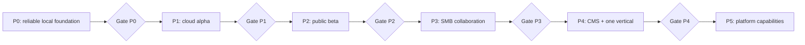

# Nexus Roadmap Execution Program

> **For agentic workers:** REQUIRED SUB-SKILL: Use superpowers:subagent-driven-development (recommended) or superpowers:executing-plans to implement this plan task-by-task. Steps use checkbox (`- [ ]`) syntax for tracking.

**Goal:** Turn `ROADMAP.md` into a controlled sequence of independently verifiable implementation plans that can be executed without losing context or mixing unrelated subsystems.

**Architecture:** The program follows one critical path from a reliable local editor to cloud publishing, production growth tooling, collaboration, CMS, and one validated business vertical. Only the active milestone receives a file-level implementation plan; the next plan is written at the preceding milestone gate from the code and contracts that actually exist then.

**Tech Stack:** Angular 20 standalone components, Signals, Angular Material/CDK, strict TypeScript, Vitest/TestBed, Playwright, NestJS, PostgreSQL, Prisma, S3-compatible object storage, SSR/CDN.

---

## How to use this program

This file is the single execution index. It answers:

- what milestone is active;
- which detailed plan to execute;
- what work is blocked;
- what evidence is required before advancing;
- when the next implementation plan must be written.

Rules:

1. Execute only one numbered work package at a time.
2. Mark a package complete only after its acceptance command and manual acceptance
   check both pass.
3. Follow RED → GREEN → REFACTOR for every behavior change.
4. Commit after each task from the detailed implementation plan.
5. Do not begin a package whose dependencies are unchecked.
6. Do not create exact backend or infrastructure tasks before the prior API and data
   contracts are proven at their gate.
7. If implementation changes a public contract, update this index and the next
   unstarted plan before continuing.
8. `ROADMAP.md` remains the product direction. This program owns execution order.

## Current status

| Item               | State    | Evidence                                   |
| ------------------ | -------- | ------------------------------------------ |
| Product roadmap    | Complete | `ROADMAP.md`                               |
| Execution program  | Complete | This file                                  |
| P0 detailed plan   | Complete | `2026-07-25-nexus-foundation-phase-0.md`   |
| P0 implementation  | Complete | P0-01 through P0-10 and the Node 24 gate   |
| P1 detailed plan   | Ready    | `2026-07-26-nexus-cloud-alpha-phase-1.md`  |
| P2+ detailed plans | Blocked  | Depend on deployed production observations |

## Critical path



## Work-package map

| ID  | Package                   | Output                                                                    | Depends on             | Detailed plan                             |
| --- | ------------------------- | ------------------------------------------------------------------------- | ---------------------- | ----------------------------------------- |
| P0  | Reliable local foundation | Testable multipage editor with repository boundary, transfer and autosave | Current code           | `2026-07-25-nexus-foundation-phase-0.md`  |
| P1  | Cloud alpha               | Authenticated cloud projects, media and public subdomains                 | Gate P0                | `2026-07-26-nexus-cloud-alpha-phase-1.md` |
| P2  | Public beta               | Domains, SSR SEO, analytics, CRM and billing limits                       | Gate P1                | Created at Gate P1                        |
| P3  | Strong SMB builder        | Reusable sections, responsive grid, roles, comments and content mode      | Gate P2                | Created at Gate P2                        |
| P4  | CMS and one vertical      | Dynamic content plus Bookings or eCommerce                                | Gate P3 and usage data | Created at Gate P3                        |
| P5  | Studio platform           | Concurrent editing, Pro canvas, SDK and enterprise controls               | Gate P4 and retention  | Created at Gate P4                        |

## P0 — Reliable local foundation

Detailed plan:
[`2026-07-25-nexus-foundation-phase-0.md`](2026-07-25-nexus-foundation-phase-0.md)

### Ordered tasks

- [x] **P0-01 — Testing foundation**
  - Add Angular TestBed/Vitest behavioral tests.
  - Add a real Playwright browser test.
  - Preserve existing source-contract tests under explicit scripts.
  - Make the complete verification command green.

- [x] **P0-02 — Persistence codecs**
  - Extract site-config normalization from local storage.
  - Extract project-storage normalization.
  - Prove schema migration and unsafe-input behavior with unit tests.

- [x] **P0-03 — Repository boundary**
  - Define an asynchronous `ProjectRepository`.
  - Make the local repository implement it.
  - Replace direct concrete-service injection with the repository token.
  - Add optimistic draft-version conflicts.

- [x] **P0-04 — State separation**
  - Extract project/session state from the document editor.
  - Extract history state.
  - Keep block mutation behavior unchanged.
  - Convert workspace and public-preview reads to asynchronous repository calls.

- [x] **P0-05 — Project transfer**
  - Export a versioned project file.
  - Import, validate and create a new project from that file.
  - Reject oversized, malformed and unsupported files without changing storage.

- [x] **P0-06 — Multipage domain**
  - Add page-level SEO and schema migration.
  - Add pure page mutation utilities.
  - Add create, rename, slug, duplicate, move and remove operations.

- [x] **P0-07 — Multipage editor UI**
  - Add a focused page manager.
  - Add page SEO fields.
  - Add confirmations and explicit error messages.

- [x] **P0-08 — Multipage public output**
  - Publish and render a page by slug.
  - Keep the no-slug URL as the home-page URL.
  - Resolve internal page links inside the published site.
  - Apply page SEO and render a page-level not-found state.

- [x] **P0-09 — Autosave and recovery**
  - [x] Debounce document changes.
  - [x] Serialize saves and preserve dirty state during overlapping edits.
  - [x] Restore the last active project.
  - [x] Surface draft-version conflicts without overwriting either version.

- [x] **P0-10 — CI and handoff**
  - Run lint, contracts, unit tests, browser tests, build and formatting in CI.
  - Verify bundle budgets through the production build.
  - Update README commands and migration notes.

### Gate P0

All conditions are mandatory:

- [x] `npm run verify` exits with code `0`.
- [x] The Playwright test creates, edits, saves, publishes and submits a lead.
- [x] A second page can be created, published and opened by slug.
- [x] Exported data can be imported in an empty browser context.
- [x] `BuilderStore` no longer reads `localStorage` or injects the local repository.
- [x] Public preview and workspace read through `ProjectRepository`.
- [x] Unsupported import and draft conflict leave stored data unchanged.
- [x] `ROADMAP.md` and README match the implemented behavior.

Gate deliverables:

1. Mark every P0 checkbox complete.
2. Record fresh command output in the implementation handoff.
3. Write `docs/superpowers/plans/<date>-nexus-cloud-alpha-phase-1.md`.
4. Base the P1 API on the proven P0 repository request/response types.

## P1 — Cloud alpha

This package begins only after Gate P0.

Detailed plan:
[`2026-07-26-nexus-cloud-alpha-phase-1.md`](2026-07-26-nexus-cloud-alpha-phase-1.md)

### Ordered epics

- [ ] **P1-01 — Backend workspace bootstrap**
  - Create the separate NestJS API repository.
  - Add the module/layer structure and architecture tests.
  - Add the Node 24 CI gate.

- [ ] **P1-02 — Platform foundation**
  - Add typed environment validation, health endpoints and structured errors.
  - Add PostgreSQL, Prisma schema and migrations.
  - Add request IDs and safe logging.

- [ ] **P1-03 — Identity and tenancy**
  - Add users, sessions, workspaces and memberships.
  - Implement owner/editor authorization.
  - Add registration, login, refresh, logout, reset and email verification.

- [ ] **P1-04 — Cloud projects**
  - Persist draft JSONB with `draftVersion`.
  - Persist immutable revisions and releases.
  - Implement optimistic save conflicts and rollback.

- [ ] **P1-05 — Immutable releases and public sites**
  - Resolve site by public slug.
  - Return only the active immutable release.
  - Add publish, unpublish and rollback operations.

- [ ] **P1-06 — Media**
  - Add presigned upload.
  - Validate MIME, extension, size and ownership.
  - Store metadata and garbage-collect unattached assets.

- [ ] **P1-07 — Server-side forms**
  - Validate fields against the published release.
  - Add rate limiting and honeypot protection.
  - Store leads and expose an authorized inbox.

- [ ] **P1-08 — Angular HTTP adapters**
  - Add auth session handling and API errors.
  - Implement the P0 `ProjectRepository`.
  - Add cloud media upload and local-project migration.

- [ ] **P1-09 — Deploy and observe**
  - Deploy API, database, object storage and frontend.
  - Add HTTPS, backups, health monitoring and error tracking.
  - Publish `<site>.nexus.site`.

- [ ] **P1-10 — Cloud Alpha gate and handoff**
  - Run both repositories from clean installs.
  - Prove deployed acceptance and failure behavior.
  - Update the execution program from real operational evidence.

### Gate P1

- [ ] A new user can register and publish from a clean browser.
- [ ] The same draft opens on a second device.
- [ ] An incognito visitor can submit a form and the owner sees the lead.
- [ ] Concurrent stale saves return a conflict and do not overwrite the latest draft.
- [ ] Restarting the API does not affect an active release.
- [ ] Backup restore is tested in a non-production environment.

Gate deliverable:
write `docs/superpowers/plans/<date>-nexus-public-beta-phase-2.md` from deployed API
contracts and operational findings.

## P2 — Public beta

This package begins only after Gate P1.

### Ordered epics

- [ ] **P2-01 — SSR public renderer and CDN caching**
- [ ] **P2-02 — Custom-domain verification and automatic SSL**
- [ ] **P2-03 — Sitemap, robots, canonical, redirects and structured data**
- [ ] **P2-04 — Responsive image processing and performance budgets**
- [ ] **P2-05 — Page/session/source/CTA/form analytics pipeline**
- [ ] **P2-06 — Leads inbox statuses, notes, search, export and notifications**
- [ ] **P2-07 — Privacy consent, retention and data deletion**
- [ ] **P2-08 — Curated template and section library**
- [ ] **P2-09 — Plans, entitlements, usage accounting and billing**
- [ ] **P2-10 — External beta onboarding and support loop**

### Gate P2

- [ ] A user connects a domain without engineering help.
- [ ] Published HTML contains complete page SEO before JavaScript executes.
- [ ] Analytics measures `visit → CTA → form → lead`.
- [ ] Ten to twenty external users publish without direct intervention.
- [ ] Product metrics identify the largest activation drop-off.

Gate deliverable:
write `docs/superpowers/plans/<date>-nexus-smb-builder-phase-3.md` and prioritize its
epics from beta evidence.

## P3 — Strong SMB builder

This package begins only after Gate P2.

### Ordered epics

- [ ] **P3-01 — Global header/footer and reusable sections**
- [ ] **P3-02 — Tablet breakpoint and per-breakpoint overrides**
- [ ] **P3-03 — Section grid, stack, alignment and size constraints**
- [ ] **P3-04 — Primitive component library**
- [ ] **P3-05 — Accessible animation presets**
- [ ] **P3-06 — Revision preview, restore and audit log**
- [ ] **P3-07 — Invitations, project roles and comments**
- [ ] **P3-08 — Restricted content-editing mode**
- [ ] **P3-09 — Multilingual pages and hreflang**
- [ ] **P3-10 — Webhooks and first lead integrations**

### Gate P3

- [ ] An agency can manage several client sites.
- [ ] A client can edit content without changing layout.
- [ ] A published revision can be restored with an audit record.
- [ ] Tablet and mobile overrides pass visual regression tests.
- [ ] Usage data identifies Bookings or eCommerce as the next vertical.

Gate deliverable:
choose one vertical and write
`docs/superpowers/plans/<date>-nexus-cms-and-<vertical>-phase-4.md`.

## P4 — CMS and one business vertical

This package begins only after Gate P3 and an explicit vertical decision.

### Shared CMS epics

- [ ] **P4-01 — Collection schema and typed fields**
- [ ] **P4-02 — Records, permissions and media references**
- [ ] **P4-03 — Block-property data bindings and repeaters**
- [ ] **P4-04 — Dynamic routes, filters and pagination**
- [ ] **P4-05 — CSV import/export and content workflow**
- [ ] **P4-06 — Blog model and editorial publishing**

### Bookings branch

Execute only if Bookings is selected:

- [ ] **P4-B01 — Services, staff and locations**
- [ ] **P4-B02 — Availability and time-zone rules**
- [ ] **P4-B03 — Booking, cancellation and capacity**
- [ ] **P4-B04 — Confirmation and reminder delivery**
- [ ] **P4-B05 — Deposit payment and refund state**

### eCommerce branch

Execute only if eCommerce is selected:

- [ ] **P4-E01 — Products, variants and inventory**
- [ ] **P4-E02 — Cart and price calculation**
- [ ] **P4-E03 — Checkout and payment state machine**
- [ ] **P4-E04 — Orders, fulfillment and notifications**
- [ ] **P4-E05 — Delivery, cancellation and refunds**

### Gate P4

- [ ] Dynamic content is editable without changing page structure.
- [ ] Published dynamic pages are indexed and cached correctly.
- [ ] The selected vertical completes one real end-to-end business transaction.
- [ ] Permission and payment state transitions have audit coverage.

Gate deliverable:
write `docs/superpowers/plans/<date>-nexus-platform-phase-5.md` only if retention and
revenue justify platform expansion.

## P5 — Studio platform capabilities

These are independently approved programs, not one release:

- [ ] **P5-01 — Real-time document protocol, presence and conflict model**
- [ ] **P5-02 — On-canvas comments, tasks and approval workflow**
- [ ] **P5-03 — Pro canvas and custom responsive behavior**
- [ ] **P5-04 — Shared design libraries**
- [ ] **P5-05 — Widget SDK and sandbox**
- [ ] **P5-06 — Public API, OAuth, webhooks and developer portal**
- [ ] **P5-07 — Marketplace submission, review and billing**
- [ ] **P5-08 — SSO, SCIM, granular RBAC and enterprise audit**
- [ ] **P5-09 — Multi-region delivery and disaster recovery**
- [ ] **P5-10 — White-label agency billing and handoff**

Each P5 program requires its own design, threat model, implementation plan and
business owner before implementation.

## Progress reporting template

Use this after each completed task:

```markdown
### <task id> — <task name>

- Result:
- Files changed:
- RED evidence:
- GREEN evidence:
- Full verification:
- Commit:
- Remaining risk:
- Next task:
```

## Stop conditions

Stop implementation and update the plan when:

- a required API or repository does not exist;
- a task needs a product choice that changes stored data or public behavior;
- the same acceptance test fails for three attempts for the same external reason;
- implementation requires changing a separate service not included in the active
  plan;
- the active task would bypass a gate or introduce a future-phase subsystem.
